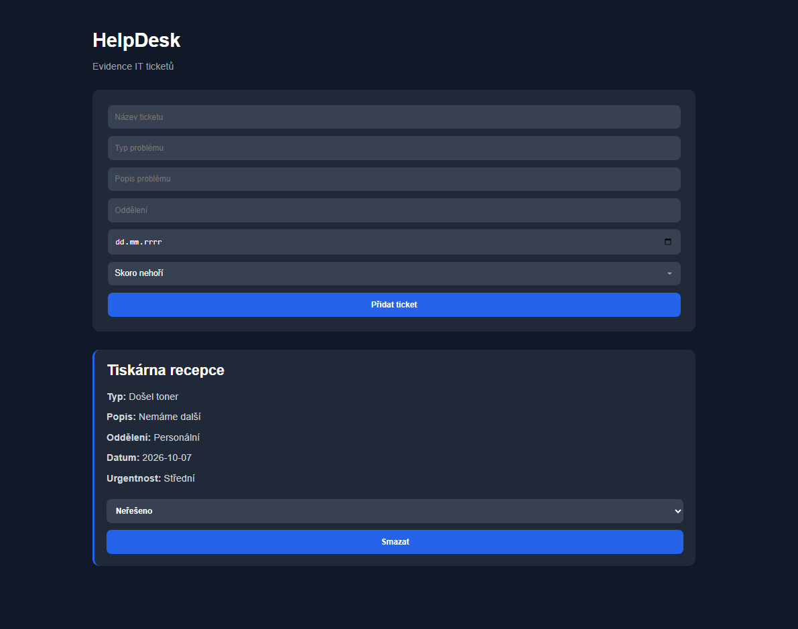

# HelpDesk — Evidence IT ticketů

Jednoduchá webová aplikace na správu IT ticketů. Umožňuje přidávat nové
tickety, zobrazovat jejich seznam, měnit stav řešení a tickety mazat.
Data se ukládají do MySQL databáze.

## Screenshot



## Použité technologie

- Python / Flask
- MySQL
- HTML, CSS (bez frameworku)

## Jak appku spustit lokálně

1. Naklonuj repozitář
   ```bash
   git clone <odkaz-na-tvoje-repo>
   cd <nazev-slozky>
   ```

2. Nainstaluj závislosti
   ```bash
   pip install -r requirements.txt
   ```

3. Vytvoř databázi a tabulku — spusť `schema.sql` v MySQL:
   ```bash
   mysql -u root -p < schema.sql
   ```

4. Vytvoř soubor `config.py` (není součástí repozitáře) s vlastními
   přihlašovacími údaji k databázi:
   ```python
   import mysql.connector

   def get_db():
       return mysql.connector.connect(
           host="localhost",
           user="tvoje_jmeno",
           password="tvoje_heslo",
           database="HelpDesk"
       )
   ```

5. Spusť aplikaci
   ```bash
   python app.py
   ```

6. Otevři v prohlížeči
   ```
   http://localhost:5000/tickets
   ```

## Funkce

- Přidání nového ticketu přes formulář (název, typ problému, popis,
  oddělení, datum, urgentnost)
- Výpis všech ticketů s informací o stavu
- Změna stavu ticketu (Neřešeno / Řeší se / Vyřešeno / Odloženo)
- Smazání ticketu
- Validace povinných polí na straně serveru
- Zobrazení informace, pokud zatím žádné tickety nejsou

## Struktura projektu

```
.
├── app.py              # routy a logika aplikace
├── config.py           # připojení k databázi (negitovaný soubor)
├── schema.sql           # SQL příkaz pro vytvoření tabulky tickets
├── requirements.txt     # závislosti
├── templates/
│   └── index.html       # formulář a seznam ticketů
└── static/
    └── style.css         # vzhled aplikace
```
